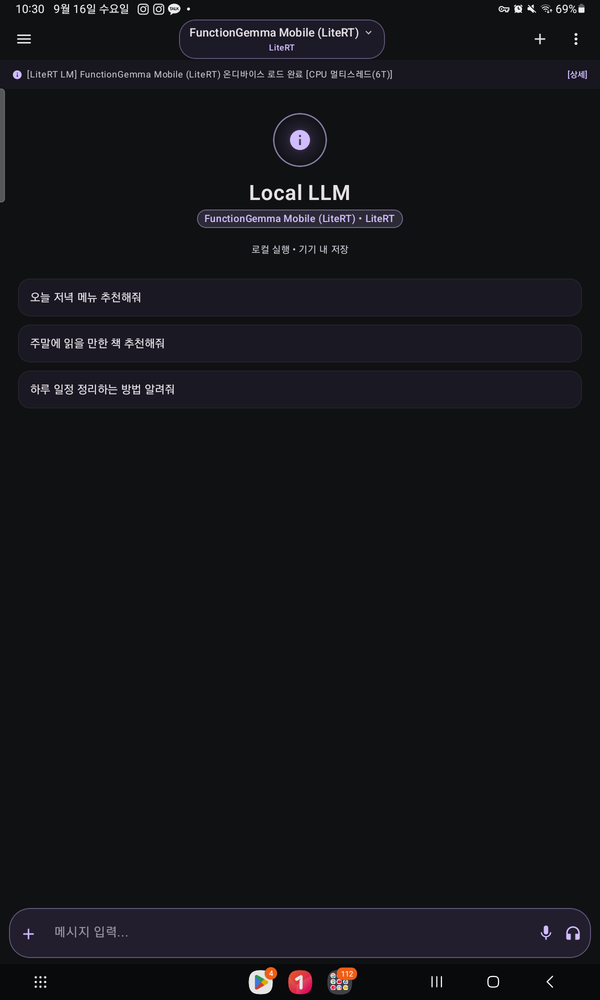
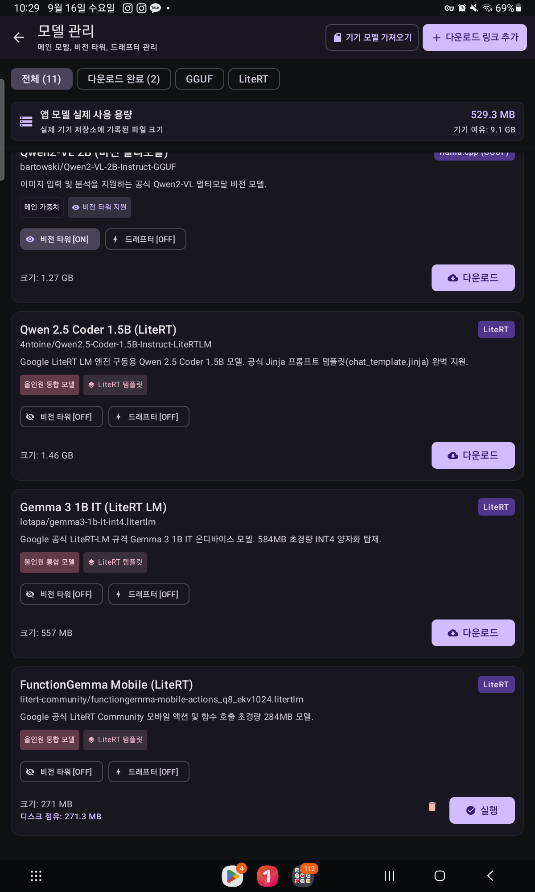
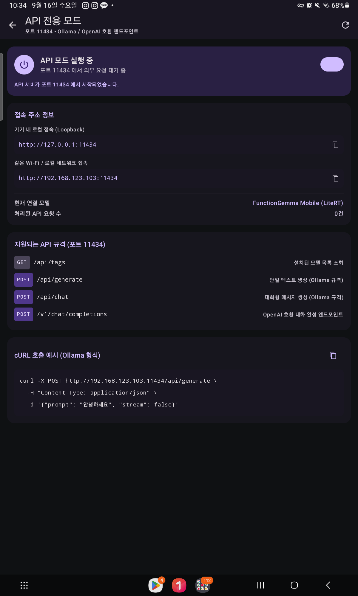
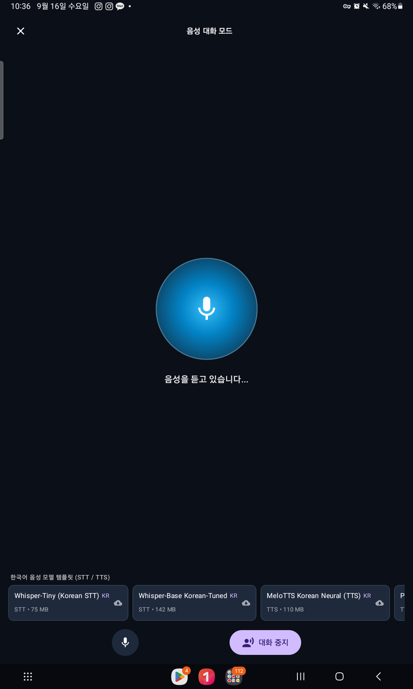

# Local LLM Android

<p align="center">
  
  
</p>

<p align="center">
  <a href="README.md">English</a> | <strong>한국어</strong>
</p>

<p align="center">
  
  
  
  
  
  
  
</p>

완전 오프라인 환경에서 동작하는 고성능 안드로이드 온디바이스 LLM(대형 언어 모델) 애플리케이션입니다. 외부 클라우드나 API 통신 없이, 기기의 CPU, GPU, NPU 하드웨어를 직접 활용하여 안전하게 인공지능 모델을 구동합니다. UI는 자체 개발 **글래스 디자인 시스템** 위에서 동작하며 설정에서 **영어/한국어 실시간 전환**이 가능하고, 채팅에서 도구 호출을 위해 네이티브 **MCP 클라이언트**를 지원합니다. 또한 자체 MoE 연구 엔진(**SDengine**)이 `:engine` 모듈로 오픈소스로 개발 중입니다.

---

## 📱 스크린샷 갤러리

| 온디바이스 채팅 & 추론 지표 | 모델 허브 & 백엔드 관리 |
| :---: | :---: |
|  |  |
| **Ollama / OpenAI 호환 API 서버** | **실시간 음성 대화 모드** |
|  |  |

---

## 🏛️ 하이브리드 이원화 런타임 아키텍처

Local LLM Android는 단일 엔진에 종속되지 않고, **llama.cpp**와 **Google LiteRT-LM** 두 가지 런타임을 모두 지원하는 하이브리드 엔진 아키텍처를 채택하고 있습니다.

```
                  ┌────────────────────────────────────────┐
                  │            MainViewModel               │
                  └───────────────────┬────────────────────┘
                                      │
                         ┌────────────┴────────────┐
                         │        LlmEngine        │
                         └──────┬────────────┬─────┘
                                │            │
                ┌───────────────┘            └───────────────┐
                ▼                                            ▼
      [ llama.cpp 런타임 ]                          [ Google LiteRT-LM 런타임 ]
   • GGUF 범용 모델 포맷 지원                     • 구글 모바일 최적화 바이너리
   • Qwen, DeepSeek-R1, Llama 3 등               • Gemma-2, 모바일 NPU 가속 타깃
   • CPU 멀티스레딩 & GPU 레이어 오프로딩          • GPU(OpenCL/Vulkan) & NPU 가속
   • mmproj 비전타워 연동 (멀티모달)              • 저전력 / 고효율 모바일 추론

        (+ SDengine — :engine 모듈의 실험적 자체 MoE 엔진, 아래 참조)
```

### 왜 두 엔진을 함께 사용하는가? (Dual-Runtime Rationale)

1. **최대 모델 생태계 호환성 (llama.cpp GGUF)**
   - 허깅페이스(Hugging Face)에 존재하는 수만 개의 오픈소스 커뮤니티 GGUF 양자화 모델(Q4_K_M, Q8_0 등)을 즉시 다운로드하여 실행할 수 있습니다.
   - DeepSeek-R1 등의 최신 추론(Reasoning) 모델, Jinja 템플릿, 멀티모달 mmproj 비전 타워를 폭넓게 지원합니다.

2. **안드로이드 네이티브 하드웨어 가속 (Google LiteRT-LM)**
   - Google의 온디바이스 AI 런타임으로 모바일 SoC(Snapdragon, MediaTek, Tensor, Exynos)의 GPU 및 NPU 델리게이트와 가장 긴밀하게 최적화되어 있습니다.
   - 전력 소모와 발열을 최소화하면서 고효율 추론을 제공합니다.

---

## 🌐 온디바이스 Ollama / OpenAI 호환 API 서버 (포트 11434)

안드로이드 폰이나 태블릿을 독립적인 **Ollama 호환 로컬 AI 서버**로 활용할 수 있습니다.

- **표준 엔드포인트 지원**:
  - `GET /api/tags` - 다운로드된 온디바이스 모델 카탈로그 조회
  - `POST /api/generate` - 단일 텍스트 생성 (Ollama 규격)
  - `POST /api/chat` - 대화형 메시지 생성 (Ollama 규격)
  - `POST /v1/chat/completions` - OpenAI SDK 및 클라이언트 호환 엔드포인트
- **네트워크 보안 및 외부 LAN 접근 제어**:
  - **로컬 루프백(`127.0.0.1`) 격리**: 기기 내부 앱 간 통신을 위한 기본 보안 모드.
  - **외부 네트워크(LAN) 접근 토글**: 토글 활성화 시 `0.0.0.0`으로 바인딩되어 동일 Wi-Fi의 PC, Mac, 개발 환경에서 안드로이드 기기로 직접 API 호출 가능.
  - **무작위 API 토큰 인증**: 서버 시작 시 생성되는 Bearer API 키를 통해 무단 접근 차단.
- **cURL 호출 예시**:
  ```bash
  curl -X POST http://<기기_IP>:11434/api/generate \
    -H "Authorization: Bearer <API_KEY>" \
    -H "Content-Type: application/json" \
    -d '{"prompt": "안녕하세요", "stream": false}'
  ```

---

## 🔒 보안 아키텍처 (Security Design)

1. **Android Keystore 기반 AES-256-GCM 암호화 (`ChatCrypto`)**
   - 하드코딩된 마스터 키를 배제하고 기기별 하드웨어 보안 모듈(Secure Element/TEE)과 연동된 `AndroidKeyStore`에서 256비트 AES 키를 생성·보관합니다.
   - 인증 암호화(AEAD) 방식을 적용하여 데이터 변조를 원천 차단합니다.
   - 하드웨어 Keystore 실패 시 취약한 키로의 암묵적 다운그레이드(Silent Downgrade)를 차단하여 완벽한 영구 프라이버시를 보장합니다.

2. **오프라인 텍스트 추론 및 로컬 저장**
   - 텍스트 추론 과정의 대화 내역 및 프롬프트가 외부 서버나 클라우드로 일절 전송되지 않습니다.
   - 모든 대화 기록은 로컬 암호화 SQLite Room 데이터베이스에만 저장됩니다.
   - 참고: 음성 인식(STT)은 **로컬 Whisper STT 엔진**(`LocalSttEngine`)으로 온디바이스 처리되며, 음성 합성(TTS)은 기기 내장 음성 서비스를 사용할 수 있습니다.

---

## ⚡ 주요 기능 및 특징

- **실시간 성능 벤치마크 지표 산출**:
  - **llama.cpp(GGUF)**: `llamaCtx.tokenize()` 네이티브 토큰화 호출을 통해 실제 토큰 수 기반의 `promptSpeed`(초당 처리 토큰 수) 및 `tps`(생성 속도)를 측정.
  - **Google LiteRT-LM**: C++ 코어의 `conv.getBenchmarkInfo()` 네이티브 지표를 직접 연동하여 오차 없는 실시간 성능 표기.
- **핸즈프리 음성 대화 모드 (Interactive Voice Mode)**:
   - 음성 인식(**로컬 Whisper STT**, 온디바이스) → 온디바이스 LLM 추론 → 음성 합성(TTS) 루프 자동 수행.
  - 리액티브 Voice Orb 애니메이션 탑재.
- **스트리밍 추론 상태머신 (`ReasoningStreamParser`)**:
  - DeepSeek-R1 등 추론 모델의 `<think>`, `</think>` 태그가 토큰 스트리밍 단위로 쪼개져 수신되는 경우에도 버퍼 상태머신을 통해 생각 과정과 최종 답변을 안정적으로 분리 표기.
- **MCP 프로토콜 클라이언트 (`McpClient`)**:
  - 네이티브 MCP 프로토콜 클라이언트를 탑재하여 세션별 격리 가드와 함께 온디바이스 채팅에서 도구 사용을 지원합니다.
- **자체 글래스 디자인 시스템 (`ui/glass`)**:
  - Material3를 완전히 제거하고 자체 글래스 UI 툴킷(`GlassTheme`, `GButtons`, `GControls`, `GOverlays` 등)으로 모든 화면을 커버합니다.
- **인앱 이중 언어 UI (영어 / 한국어)**:
  - 설정에서 시스템 기본값 / English / 한국어를 앱 재시작 없이 즉시 실시간 전환합니다.
- **사전 OOM 진단 및 보호 가드 (`checkMemoryDiagnostics`)**:
  - 모델 로딩 전 `ActivityManager.MemoryInfo`를 통해 가용 RAM과 모델 파일 크기를 대조하여 메모리 고갈로 인한 네이티브 프로세스 비정상 종료(SIGSEGV)를 사전 예방.
- **타입 안전한 전역 네비게이션 (`AppScreen`) & 시스템 제스처 핸들링**:
  - 모든 UI 화면 컴포넌트의 화면 전환을 `AppScreen` enum으로 관리하며, 서브 화면에서 시스템 뒤로가기 제스처 시 메인 채팅으로 자연스럽게 복귀.

---

## 🧪 SDengine — 실험적 자체 추론 엔진 (`:engine`)

독립 안드로이드 라이브러리 모듈로 자체 MoE 전용 추론 코어를 오픈소스로 개발하고 있습니다.

**범위(의도된 설계):** 안드로이드에서 C++로 동작하는 gated-expert Mixture-of-Experts 전용. Dense 전용 모델 및 비-MoE 하이브리드는 범위 밖입니다.

**현재 포함된 것:**
- GGUF 리더 + 메타데이터 감지, BPE 토크나이저, 샘플러, KV 캐시 (`GgufReader`, `BpeTokenizer`, `Sampler`, `KvCache`)
- 페이징 전문가 스트리밍: dense 가중치는 상한 내 상주 디코딩, expert 타일은 스토리지에 두고 `ExpertPager`로 스트리밍
- NDK 27 + CMake 기반 C++ JNI 코어 (`arm64-v8a`, `x86_64`)
- 실제 MoE 가중치 기반 수치 검증 (라이브 Qwen3-30B-A3B를 HTTP range 스트리밍으로 검증)

**상태: TEST BUILD / 실험체 — 프로덕션 사용 금지.**
- 레퍼런스 스칼라 커널로 수학을 검증 중이며, NEON/GPU 커널이 다음 단계입니다.
- 온디바이스 엔드투엔드 추론은 아직 준비되지 않았으며, 앱 레이어는 조용한 추론을 거부하고 엔진 어드바이저리(`SDEngine.ADVISORIES`)를 표시합니다.

---

## 🛠️ 빌드 및 요구 사항

### 요구 사항
- Android Studio Ladybug 이상 / JDK 17
- Android SDK 36, Min SDK 24
- Android NDK 27.2 + CMake 3.22 이상 (`:engine` 모듈 빌드에 필요)
- NDK 지원 기기 (ARM64-v8a, x86_64)
- 네이티브 의존성 수동 설치 불필요: sherpa-onnx STT AAR(약 50MB)은 저장소에 커밋하지 않고, 빌드 전 Gradle `fetchSherpaAar` 태스크가 버전·SHA-256 고정값으로 자동 다운로드합니다.

### 빌드 명령어
```bash
# 디버그 컴파일
./gradlew compileDebugKotlin

# 단위 테스트 실행
./gradlew testDebugUnitTest

# 릴리즈 APK 빌드
./gradlew assembleRelease
```

### 릴리즈 서명

릴리즈 빌드는 debug 키로 서명되지 않습니다. 업로드 키스토어 자격증명을 환경 변수
(`KEYSTORE_PATH`, `STORE_PASSWORD`, `KEY_PASSWORD`, 선택 `KEY_ALIAS`)로 넘기거나, 로컬 빌드의
경우 저장소 루트의 gitignore 처리된 `keystore.properties`에 넣으세요:

```properties
storeFile=my-upload-key.jks
storePassword=...
keyAlias=upload
keyPassword=...
```

계측 테스트는 연결된 기기/에뮬레이터에서 실행합니다: `./gradlew connectedDebugAndroidTest`.

---

## 📄 라이선스 (License)

이 프로젝트는 [Apache License 2.0](LICENSE)에 따라 자유롭게 사용 및 배포할 수 있습니다.
